Hi This is SHYAM K S
---

# Welcome to My Data Structures Repository

Welcome to my repository dedicated to mastering Data Structures in Java programming!

Whether you're a beginner looking to understand the basics or an experienced developer aiming to refine your skills, this repository is designed to provide you with comprehensive resources and hands-on practice in data structures.

## What You'll Find Here

- **Detailed Explanations**: Clear and concise explanations of various data structures, including Arrays, Linked Lists, Stacks, Queues, Trees, and Graphs.
- **Java Implementations**: Practical Java code examples that demonstrate how to implement and utilize these data structures.
- **Advanced Structures**: Insights into more advanced data structures such as Segment Trees, Tries, and Red-Black Trees.
- **Visual Aids**: Diagrams and visual representations to help you grasp complex concepts more easily.
- **Coding Practice**: A collection of exercises and coding challenges to help reinforce your understanding and test your skills.
- **Quizzes and Articles**: Engaging quizzes and articles to further your learning and keep you up-to-date with the latest in data structures.

## Why Learn Data Structures?

Understanding data structures is crucial for effective problem-solving and optimizing the performance of your Java applications. With the knowledge of various data structures, you can:

- Improve the efficiency of your algorithms.
- Enhance your ability to solve complex problems.
- Develop a deeper understanding of how data can be organized and manipulated.

Feel free to explore the repository, dive into the materials, and start coding. Happy learning and coding!

## Getting Started

To get started, you can browse through the [Table of Contents](#table-of-contents) to find topics that interest you. If you have any questions or need further assistance, don’t hesitate to open an issue or reach out.

Enjoy your journey into the world of Data Structures in Java!

Happy Coding!
Here's a structured Table of Contents based on the provided content:

# Table of Contents

1. [Introduction](#introduction)
   - [Welcome to My Data Structures Repository](#welcome-to-my-data-structures-repository)
   - [Why Learn Data Structures?](#why-learn-data-structures)
   - [Getting Started](#getting-started)

2. [Primitive Data Structures](#primitive-data-structures)
   - [Integer](#integer)
   - [Float](#float)
   - [Character](#character)
   - [Boolean](#boolean)

3. [Non-Primitive Data Structures](#non-primitive-data-structures)
   - [Linear Data Structures](#linear-data-structures)
     - [Arrays](#arrays)
     - [Linked Lists](#linked-lists)
     - [Stacks](#stacks)
     - [Queues](#queues)
   - [Non-Linear Data Structures](#non-linear-data-structures)
     - [Trees](#trees)
     - [Graphs](#graphs)

4. [Hash-Based Structures](#hash-based-structures)
   - [Hash Tables](#hash-tables)
   - [Hashing Techniques](#hashing-techniques)

5. [Advanced Data Structures](#advanced-data-structures)
   - [Advanced Lists](#advanced-lists)
     - [Memory Efficient Doubly Linked List](#memory-efficient-doubly-linked-list)
     - [XOR Linked List](#xor-linked-list)
     - [Skip List](#skip-list)
     - [Unrolled Linked List](#unrolled-linked-list)
   - [Segment Trees](#segment-trees)
     - [Introduction to Segment Trees](#introduction-to-segment-trees)
     - [Range Queries](#range-queries)
     - [Lazy Propagation](#lazy-propagation)
   - [Tries](#tries)
     - [Insert and Search](#insert-and-search)
     - [Delete](#delete)
   - [Binary Indexed Trees](#binary-indexed-trees)
     - [Introduction](#introduction)
     - [Range Updates and Point Queries](#range-updates-and-point-queries)
   - [Suffix Arrays and Trees](#suffix-arrays-and-trees)
     - [Suffix Array Introduction](#suffix-array-introduction)
     - [Suffix Tree Introduction](#suffix-tree-introduction)
   - [AVL Trees](#avl-trees)
     - [Insertion](#insertion)
     - [Deletion](#deletion)
   - [Splay Trees](#splay-trees)
     - [Search](#search)
     - [Insert](#insert)
   - [B Trees](#b-trees)
     - [Introduction](#introduction)
     - [Insert](#insert)
     - [Delete](#delete)
   - [Red-Black Trees](#red-black-trees)
     - [Introduction](#introduction)
     - [Insertion](#insertion)
     - [Deletion](#deletion)
   - [KD Trees](#kd-trees)
     - [Search and Insert](#search-and-insert)
     - [Find Minimum](#find-minimum)
     - [Delete](#delete)

6. [Coding Practice and Quizzes](#coding-practice-and-quizzes)
   - [Coding Practice](#coding-practice)
   - [Quizzes](#quizzes)
   - [Articles](#articles)

7. [Additional Resources](#additional-resources)
   - [Further Reading](#further-reading)
   - [Tools and Libraries](#tools-and-libraries)
   - [Community and Forums](#community-and-forums)

8. [Contributing](#contributing)
   - [How to Contribute](#how-to-contribute)
   - [Guidelines](#guidelines)

9. [License](#license)

10. [Contact](#contact)
    - [Feedback](#feedback)
    - [Questions](#questions)

---

## Data Structures Overview

1. [What is Data Structure?](#what-is-data-structure)
2. [Classification of Data Structures](#classification-of-data-structures)

## Primitive Data Structures

1. [Array Data Structure](#array-data-structure)
   - [Basic Operations](#basic-operations)
   - [Array Manipulations](#array-manipulations)
   - [Advanced Problems](#advanced-problems)
   - [Visualization](#visualization)

2. [Linked List Data Structure](#linked-list-data-structure)
   - [Singly Linked List](#singly-linked-list)
   - [Circular Linked List](#circular-linked-list)
   - [Doubly Linked List](#doubly-linked-list)
   - [Visualization](#visualization)

3. [Matrix Data Structure](#matrix-data-structure)
   - [Search in Row-wise and Column-wise Sorted Matrix](#search-in-row-wise-and-column-wise-sorted-matrix)
   - [Print Matrix in Spiral Form](#print-matrix-in-spiral-form)
   - [Visualization](#visualization)

4. [Stack Data Structure](#stack-data-structure)
   - [Introduction to Stack](#introduction-to-stack)
   - [Common Operations](#common-operations)
   - [Infix to Postfix Conversion](#infix-to-postfix-conversion)
   - [Visualization](#visualization)

5. [Queue Data Structure](#queue-data-structure)
   - [Introduction and Array Implementation](#introduction-and-array-implementation)
   - [Priority Queue](#priority-queue)
   - [Visualization](#visualization)

6. [Binary Tree Data Structure](#binary-tree-data-structure)
   - [Introduction and Properties](#introduction-and-properties)
   - [Tree Traversals](#tree-traversals)
   - [Visualization](#visualization)

7. [Binary Search Tree Data Structure](#binary-search-tree-data-structure)
   - [Search and Insert in BST](#search-and-insert-in-bst)
   - [Deletion from BST](#deletion-from-bst)
   - [Visualization](#visualization)

8. [Heap Data Structure](#heap-data-structure)
   - [Binary Heap](#binary-heap)
   - [Heap Sort](#heap-sort)
   - [Visualization](#visualization)

9. [Hashing Data Structure](#hashing-data-structure)
   - [Hashing Introduction](#hashing-introduction)
   - [Collision Handling](#collision-handling)
   - [Visualization](#visualization)

10. [Graph Data Structure](#graph-data-structure)
    - [Representations](#representations)
    - [Traversals](#traversals)
    - [Visualization](#visualization)

11. [Advanced Data Structures](#advanced-data-structures)
    - [Advanced Lists](#advanced-lists)
    - [Segment Tree](#segment-tree)
    - [Trie Data Structure](#trie-data-structure)
    - [Binary Indexed Tree (Fenwick Tree)](#binary-indexed-tree-fenwick-tree)
    - [Suffix Array and Suffix Tree](#suffix-array-and-suffix-tree)
    - [AVL Tree](#avl-tree)
    - [Splay Tree](#splay-tree)
    - [B Tree](#b-tree)
    - [Red-Black Tree](#red-black-tree)
    - [KD Tree](#kd-tree)
    - [Visualization](#visualization)

---

Feel free to adjust or add any sections based on the content you have!
# Data Structures Overview

## What is Data Structure?

A **data structure** is a specialized format for organizing and storing data. It provides a way to manage data efficiently and is fundamental to designing efficient algorithms. Data structures can be classified based on their type, purpose, and operations. 

**Types:**
- **Linear Data Structures**: Arrays, Linked Lists, Stacks, Queues
- **Non-linear Data Structures**: Trees, Graphs
- **Hash-based Structures**: Hash Tables
- **Advanced Data Structures**: Heaps, Tries, Segment Trees, Suffix Trees

**Applications:**
- **Arrays**: Useful for storing and accessing elements in a fixed-size collection.
- **Linked Lists**: Efficient for dynamic memory allocation and frequent insertions/deletions.
- **Stacks and Queues**: Ideal for scenarios requiring Last-In-First-Out (LIFO) or First-In-First-Out (FIFO) operations.
- **Trees and Graphs**: Suitable for hierarchical and networked data representation.
- **Hashing**: Provides fast data retrieval based on key values.

## Classification of Data Structures

1. **Primitive Data Structures**: Integer, Float, Character, etc.
2. **Non-Primitive Data Structures**: Arrays, Lists, Stacks, Queues, Trees, Graphs
   - **Linear Data Structures**: Arrays, Linked Lists, Stacks, Queues
   - **Non-Linear Data Structures**: Trees, Graphs
   - **Hash-Based Structures**: Hash Tables
   - **Advanced Data Structures**: Heaps, Tries, Segment Trees, Suffix Trees

# Classification of Data Structures

``` mermaid
graph TD
    A[Data Structures] --> B[Primitive Data Structures]
    A --> C[Non-Primitive Data Structures]
    A --> D[Hash-Based Structures]
    A --> E[Advanced Data Structures]

    B --> B1[Integer]
    B --> B2[Float]
    B --> B3[Character]
    B --> B4[Boolean]

    C --> C1[Linear Data Structures]
    C --> C2[Non-Linear Data Structures]
    
    C1 --> C1a[Arrays]
    C1 --> C1b[Linked Lists]
    C1 --> C1c[Stacks]
    C1 --> C1d[Queues]
    
    C2 --> C2a[Trees]
    C2 --> C2b[Graphs]
    
    E --> E1[Advanced Lists]
    E --> E2[Segment Trees]
    E --> E3[Tries]
    E --> E4[Binary Indexed Trees]
    E --> E5[Suffix Arrays and Trees]
    E --> E6[AVL Trees]
    E --> E7[Splay Trees]
    E --> E8[B Trees]
    E --> E9[Red-Black Trees]
    E --> E10[KD Trees]

    D --> D1[Hash Tables]
    D --> D2[Hashing Techniques]

    %% Style Definitions
    classDef main fill:#f9f,stroke:#333,stroke-width:2px;
    classDef primitive fill:#ccf,stroke:#333,stroke-width:2px;
    classDef nonPrimitive fill:#cfc,stroke:#333,stroke-width:2px;
    classDef advanced fill:#fcc,stroke:#333,stroke-width:2px;
    class A main;
    class B,C,D,E main;
    class B1,B2,B3,B4 primitive;
    class C1,C2 nonPrimitive;
    class E1,E2,E3,E4,E5,E6,E7,E8,E9,E10 advanced;
```
## Introduction to Data Structures

Data structures are used to manage and organize data to perform operations efficiently. They can be classified into:

- **Arrays**: Fixed-size, indexed collection of elements.
- **Linked Lists**: Nodes linked sequentially.
- **Stacks**: Collection of elements with LIFO order.
- **Queues**: Collection of elements with FIFO order.
- **Trees**: Hierarchical structures with nodes.
- **Graphs**: Network of nodes and edges.

**Common Operations:**
- **Insertion**: Adding data.
- **Deletion**: Removing data.
- **Search**: Finding data.
- **Traversal**: Visiting all elements.

---

## Array Data Structure

### Basic Operations

- **Search, Insert, and Delete in an Unsorted Array**
  - **Search**: Linear search.
  - **Insert**: Append at the end.
  - **Delete**: Remove the element and shift others.

- **Search, Insert, and Delete in a Sorted Array**
  - **Search**: Binary search.
  - **Insert**: Find the position and shift elements.
  - **Delete**: Remove the element and shift others.

### Array Manipulations

- **Reverse an Array**
  ```cpp
  void reverseArray(int arr[], int size) {
      int start = 0, end = size - 1;
      while (start < end) {
          std::swap(arr[start], arr[end]);
          start++;
          end--;
      }
  }
  ```

- **Find Leaders in an Array**
  ```cpp
  void printLeaders(int arr[], int size) {
      int max_from_right = arr[size - 1];
      std::cout << max_from_right << " ";
      for (int i = size - 2; i >= 0; i--) {
          if (arr[i] > max_from_right) {
              max_from_right = arr[i];
              std::cout << max_from_right << " ";
          }
      }
  }
  ```

- **Find Pair with Sum `x`**
  ```cpp
  bool hasPairWithSum(int arr[], int size, int x) {
      std::unordered_set<int> s;
      for (int i = 0; i < size; i++) {
          if (s.find(x - arr[i]) != s.end()) return true;
          s.insert(arr[i]);
      }
      return false;
  }
  ```

### Advanced Problems

- **Median of Two Sorted Arrays**
  ```cpp
  double findMedianSortedArrays(int nums1[], int size1, int nums2[], int size2) {
      std::vector<int> merged(size1 + size2);
      std::merge(nums1, nums1 + size1, nums2, nums2 + size2, merged.begin());
      int mid = merged.size() / 2;
      if (merged.size() % 2 == 0)
          return (merged[mid - 1] + merged[mid]) / 2.0;
      else
          return merged[mid];
  }
  ```

- **Rotate an Array**
  ```cpp
  void rotateArray(int arr[], int size, int d) {
      std::reverse(arr, arr + d);
      std::reverse(arr + d, arr + size);
      std::reverse(arr, arr + size);
  }
  ```

### Visualization

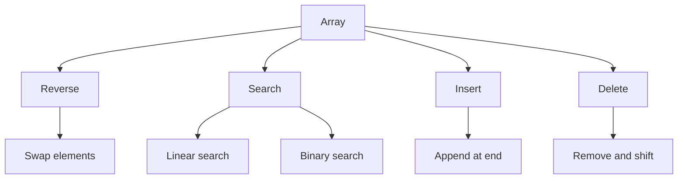

---

## Linked List Data Structure

### Singly Linked List

- **Introduction to Linked List**
  - **Linked List vs Array**: Dynamic size vs fixed size, ease of insertion/deletion.
- **Insertion and Deletion**
  - **Insertion**: At head, at end, after a given node.
  - **Deletion**: Remove a node with a specific key or at a specific position.

```cpp
struct Node {
    int data;
    Node* next;
};

void insertAtEnd(Node*& head, int data) {
    Node* newNode = new Node{data, nullptr};
    if (!head) {
        head = newNode;
        return;
    }
    Node* temp = head;
    while (temp->next) {
        temp = temp->next;
    }
    temp->next = newNode;
}

void deleteNode(Node*& head, int key) {
    Node* temp = head;
    Node* prev = nullptr;
    if (temp && temp->data == key) {
        head = temp->next;
        delete temp;
        return;
    }
    while (temp && temp->data != key) {
        prev = temp;
        temp = temp->next;
    }
    if (temp) {
        prev->next = temp->next;
        delete temp;
    }
}
```

- **Reverse a Linked List**
  ```cpp
  Node* reverse(Node* head) {
      Node* prev = nullptr;
      Node* current = head;
      Node* next = nullptr;
      while (current) {
          next = current->next;
          current->next = prev;
          prev = current;
          current = next;
      }
      return prev;
  }
  ```

### Circular Linked List

- **Introduction and Applications**
  - **Circular Singly Linked List Insertion**: Node points to the head.
  - **Traversal**: Iteratively traverse until the head is reached again.

### Doubly Linked List

- **Introduction and Insertion**
  - **Doubly Linked List**: Nodes with pointers to both next and previous nodes.
  - **Insertion**: At head, at end, before, and after a given node.

```cpp
struct DoublyNode {
    int data;
    DoublyNode* next;
    DoublyNode* prev;
};

void insertAtHead(DoublyNode*& head, int data) {
    DoublyNode* newNode = new DoublyNode{data, head, nullptr};
    if (head) head->prev = newNode;
    head = newNode;
}
```

### Visualization

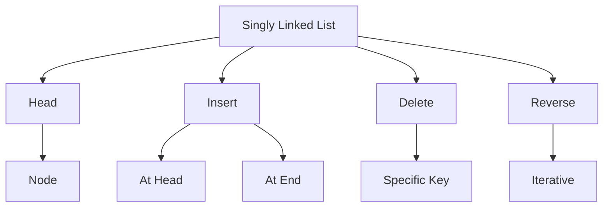

---

## Matrix Data Structure

- **Search in Row-wise and Column-wise Sorted Matrix**
  ```cpp
  bool searchMatrix(int matrix[][], int rows, int cols, int target) {
      int i = 0, j = cols - 1;
      while (i < rows && j >= 0) {
          if (matrix[i][j] == target) return true;
          if (matrix[i][j] > target) j--;
          else i++;
      }
      return false;
  }
  ```

- **Print Matrix in Spiral Form**
  ```cpp
  void printSpiral(int matrix[][], int rows, int cols) {
      int top = 0, bottom = rows - 1, left = 0, right = cols - 1;
      while (top <= bottom && left <= right) {
          for (int i = left; i <= right; i++) std::cout << matrix[top][i] << " ";
          top++;
          for (int i = top; i <= bottom; i++) std::cout << matrix[i][right] << " ";
          right--;
          if (top <= bottom) {
              for (int i = right; i >= left; i--) std::cout << matrix[bottom][i] << " ";
              bottom--;


          }
          if (left <= right) {
              for (int i = bottom; i >= top; i--) std::cout << matrix[i][left] << " ";
              left++;
          }
      }
  }
  ```

### Visualization

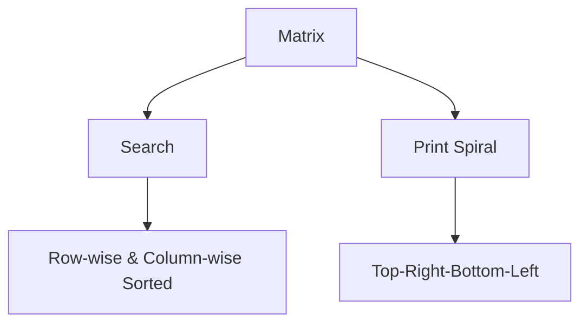

---

## Stack Data Structure

- **Introduction to Stack**
  - **LIFO Order**: Last-In-First-Out.
- **Common Operations**
  - **Push**: Add an element.
  - **Pop**: Remove the top element.
  - **Peek**: View the top element.

```cpp
class Stack {
    std::stack<int> s;
public:
    void push(int x) { s.push(x); }
    void pop() { if (!s.empty()) s.pop(); }
    int top() { return s.top(); }
};
```

- **Infix to Postfix Conversion**
  ```cpp
  std::string infixToPostfix(const std::string& infix) {
      std::stack<char> s;
      std::string postfix;
      for (char c : infix) {
          if (isalnum(c)) postfix += c;
          else if (c == '(') s.push(c);
          else if (c == ')') {
              while (!s.empty() && s.top() != '(') {
                  postfix += s.top();
                  s.pop();
              }
              s.pop();
          } else {
              while (!s.empty() && precedence(c) <= precedence(s.top())) {
                  postfix += s.top();
                  s.pop();
              }
              s.push(c);
          }
      }
      while (!s.empty()) {
          postfix += s.top();
          s.pop();
      }
      return postfix;
  }
  ```

### Visualization

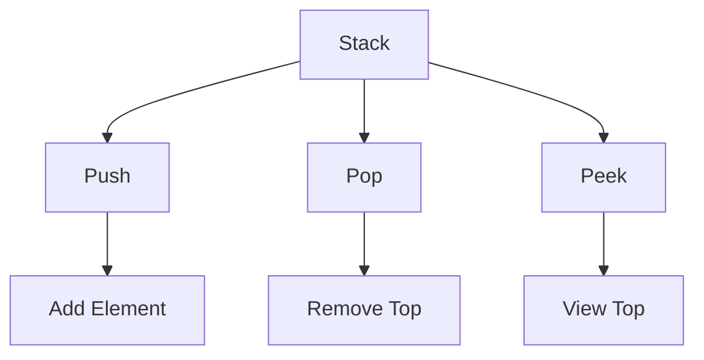

---

## Queue Data Structure

- **Introduction and Array Implementation**
  - **FIFO Order**: First-In-First-Out.
  - **Circular Queue**: Array-based circular implementation.

```cpp
class Queue {
    int front, rear, size;
    int* queue;
public:
    Queue(int capacity) : front(0), rear(-1), size(0) {
        queue = new int[capacity];
    }
    void enqueue(int x) { /* Implementation */ }
    void dequeue() { /* Implementation */ }
};
```

- **Priority Queue**
  - **Heap-based**: Elements with highest priority are dequeued first.

### Visualization

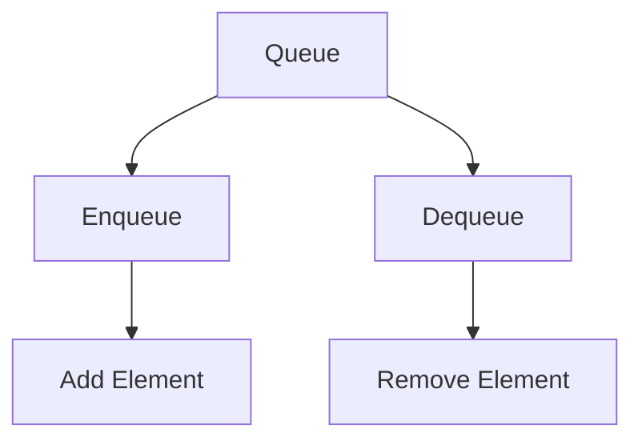

---

## Binary Tree Data Structure

- **Introduction and Properties**
  - **Binary Tree**: Each node has at most two children.
  - **Properties**: Depth, height, and balance.

- **Tree Traversals**
  - **Inorder**: Left-Root-Right.
  - **Preorder**: Root-Left-Right.
  - **Postorder**: Left-Right-Root.
  - **Level Order**: Breadth-First.

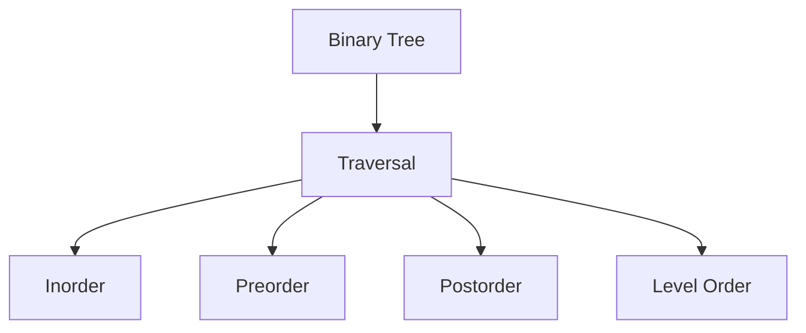

---

## Binary Search Tree Data Structure

- **Search and Insert in BST**
  - **Search**: Traverse left for smaller values, right for larger.
  - **Insert**: Insert in the appropriate subtree based on the value.

```cpp
class BST {
    TreeNode* root;
public:
    void insert(int value) { /* Implementation */ }
    TreeNode* search(int value) { /* Implementation */ }
};
```

- **Deletion from BST**
  - **Case 1**: Node has no children.
  - **Case 2**: Node has one child.
  - **Case 3**: Node has two children.

### Visualization

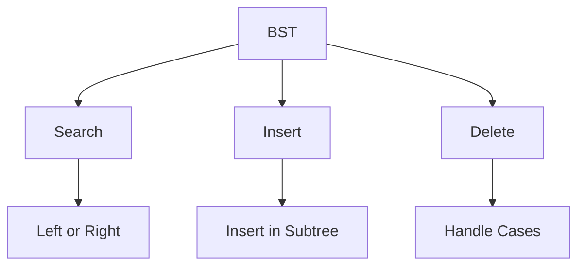

---

## Heap Data Structure

- **Binary Heap**
  - **Min-Heap**: Root is the minimum element.
  - **Max-Heap**: Root is the maximum element.
- **Heap Sort**: Sorting algorithm using heaps.

### Visualization

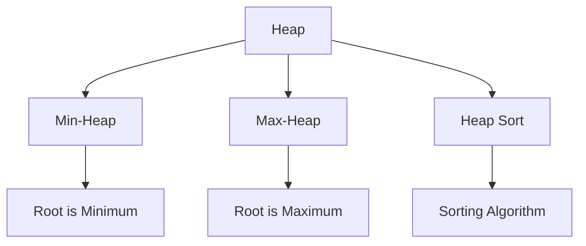

---

## Hashing Data Structure

- **Hashing Introduction**
  - **Hash Table**: Data structure for fast retrieval using keys.
- **Collision Handling**
  - **Separate Chaining**: Use linked lists for collisions.
  - **Open Addressing**: Find another slot using probing.

### Visualization

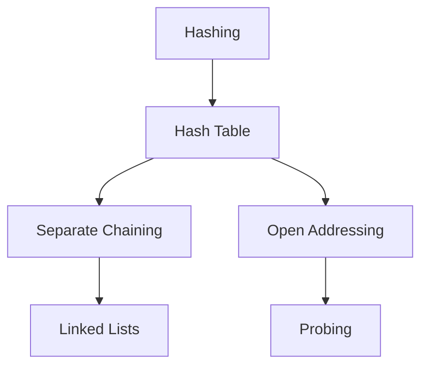

---

## Graph Data Structure

- **Representations**
  - **Adjacency Matrix**: Matrix representation.
  - **Adjacency List**: List of edges for each vertex.

- **Traversals**
  - **Breadth-First Search (BFS)**
  - **Depth-First Search (DFS)**

### Visualization

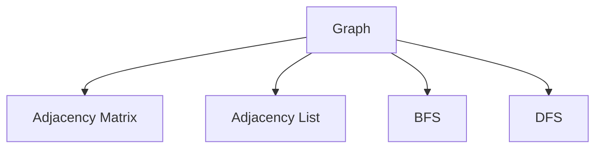

---

## Advanced Data Structure

### Advanced Lists

- **Memory Efficient Doubly Linked List**
  - **XOR Linked List**: Nodes store XOR of addresses.

### Segment Tree

- **Segment Tree Basics**
  - **Range Queries**: Sum, minimum, maximum.
  - **Lazy Propagation**: Efficient updates.

### Trie Data Structure

- **Trie Operations**
  - **Insert**: Add words.
  - **Search**: Find words.

### Binary Indexed Tree (Fenwick Tree)

- **Range Queries and Updates**
  - **Point Queries**: Efficient querying.

### Suffix Array and Suffix Tree

- **Suffix Array**: Sorting of suffixes.
- **Suffix Tree**: Efficient substring searches.

### AVL Tree

- **Balanced BST**
  - **Insertion and Deletion**: Maintain balance.

### Splay Tree

- **Self-Adjusting BST**
  - **Search and Insert**: Nodes are moved to the root.

### B Tree

- **Balanced Tree**
  - **Insertion and Deletion**: Balanced with multiple children.

### Red-Black Tree

- **Balanced BST**
  - **Insertion and Deletion**: Maintain red-black properties.

### KD Tree

- **Multi-dimensional Tree**
  - **Search and Insert**: Efficient spatial queries.

### Visualization

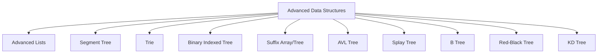

---

