# Data Structures

## Table of Contents
1. [Introduction](#introduction)
2. [Arrays](#arrays)
   - [Characteristics](#characteristics)
   - [Flow Chart](#flow-chart)
   - [Operations](#operations)
     - [Search](#search)
     - [Insert](#insert)
     - [Delete](#delete)
     - [Sorting](#sorting)
3. [Linked Lists](#linked-lists)
   - [Singly Linked List](#singly-linked-list)
   - [Doubly Linked List](#doubly-linked-list)
   - [Circular Linked List](#circular-linked-list)
4. [Stacks](#stacks)
5. [Queues](#queues)
   - [Simple Queue](#simple-queue)
   - [Circular Queue](#circular-queue)
   - [Priority Queue](#priority-queue)
6. [Trees](#trees)
   - [Binary Trees](#binary-trees)
   - [Binary Search Trees](#binary-search-trees)
   - [AVL Trees](#avl-trees)
   - [Heap Trees](#heap-trees)
7. [Graphs](#graphs)
   - [Graph Representations](#graph-representations)
   - [Graph Traversal Algorithms](#graph-traversal-algorithms)
8. [Hash Tables](#hash-tables)

---

## Introduction

Data structures are ways to store and organize data efficiently. Choosing the right data structure can significantly impact the performance of algorithms and systems. Below are the fundamental data structures, their properties, and use cases.

---

## Arrays

An array is a collection of elements identified by index or key. Arrays have a fixed size, and elements are stored in contiguous memory locations.

### Characteristics
- **Fixed Size**: The size of an array is determined at initialization.
- **Indexed Access**: Elements can be accessed directly using their index.

### Example

```markdown
Index:     0  1  2  3
Array:   [10, 20, 30, 40]
```

### Flow Chart

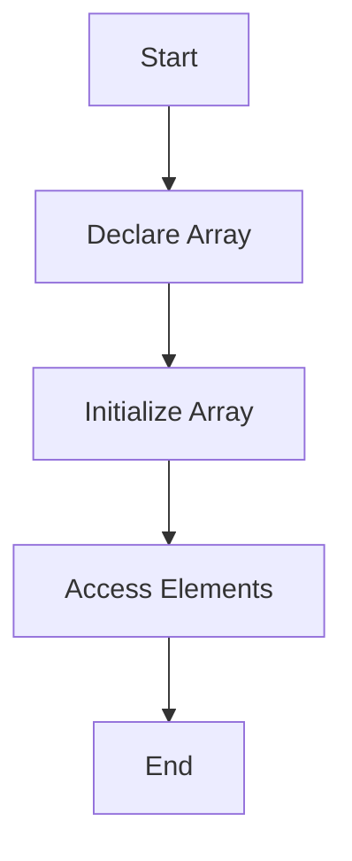

### Operations

#### 1. Search

**Searching** involves finding an element within an array. The two common search algorithms are Linear Search and Binary Search.

**Linear Search**: Sequentially checks each element until the desired element is found or the end of the array is reached.

**Linear Search Example**

```mermaid
graph TD;
    A[Start] --> B[Initialize Index = 0]
    B --> C{Is Index < Size}
    C -- Yes --> D{Is Array[Index] == Target}
    D -- Yes --> E[Return Index]
    D -- No --> F[Increment Index]
    F --> C
    C -- No --> G[Element Not Found]
    E --> H[End]
    G --> H
```

**Binary Search**: Efficiently finds an element in a sorted array by repeatedly dividing the search interval in half.

**Binary Search Example**

```mermaid
graph TD;
    A[Start] --> B[Initialize Low and High]
    B --> C[Calculate Middle]
    C --> D{Is Array[Middle] == Target}
    D -- Yes --> E[Return Middle]
    D -- No --> F{Is Target < Array[Middle]}
    F -- Yes --> G[Set High = Middle - 1]
    F -- No --> H[Set Low = Middle + 1]
    G --> B
    H --> B
    E --> I[End]
```

#### 2. Insert

**Inserting** an element involves adding it to a specific position in the array. If the array is full, it might require resizing.

**Insert Example**

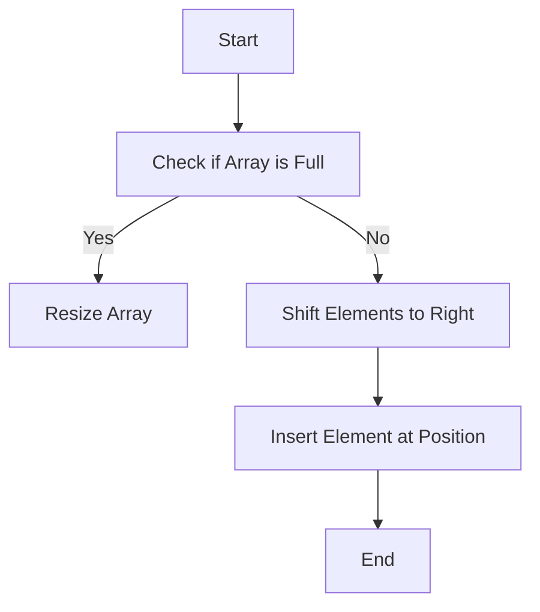

#### 3. Delete

**Deleting** an element involves removing it from a specific position and shifting the subsequent elements to fill the gap.

**Delete Example**

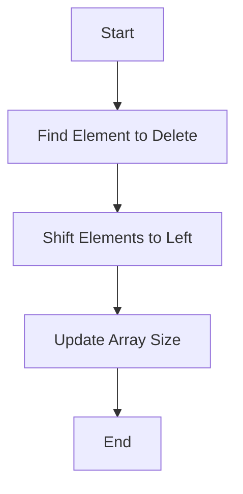

#### 4. Sorting

**Sorting** involves arranging the elements of the array in a specific order (ascending or descending). Common sorting algorithms include Bubble Sort, Selection Sort, and Merge Sort.

**Bubble Sort Example**

```mermaid
graph TD;
    A[Start] --> B[Initialize i = 0]
    B --> C{Is i < Size - 1}
    C -- Yes --> D[Initialize j = 0]
    D --> E{Is j < Size - i - 1}
    E -- Yes --> F{Is Array[j] > Array[j + 1]}
    F -- Yes --> G[Swap Array[j] and Array[j + 1]]
    G --> H[Increment j]
    F -- No --> H
    H --> E
    E -- No --> I[Increment i]
    I --> C
    C -- No --> J[End]
```

**Merge Sort Example**

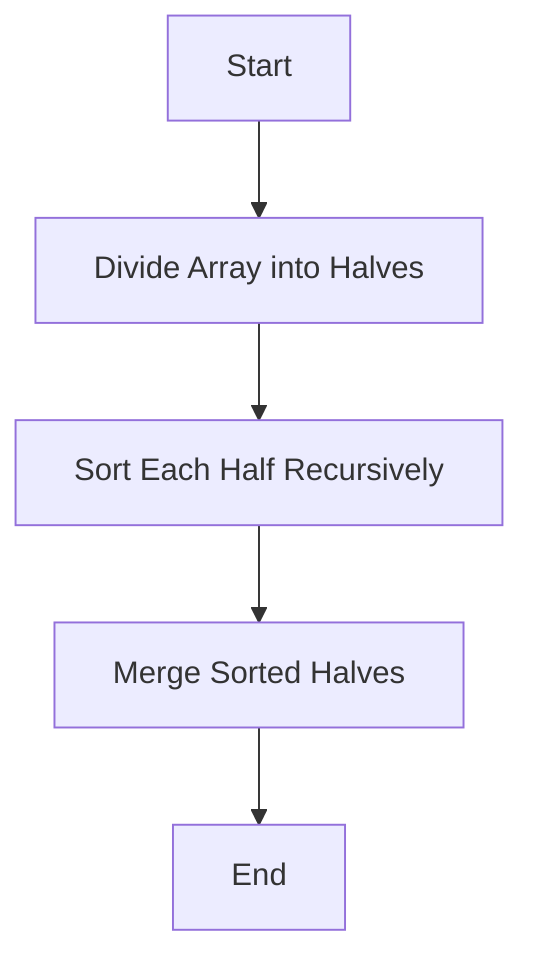

---

## Linked Lists

A linked list is a linear collection of nodes where each node contains a data element and a reference to the next node in the sequence.

### Singly Linked List

In a singly linked list, each node points to the next node. It allows for efficient insertion and deletion.

#### Example

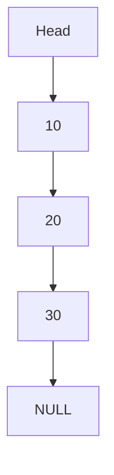

### Flow Chart

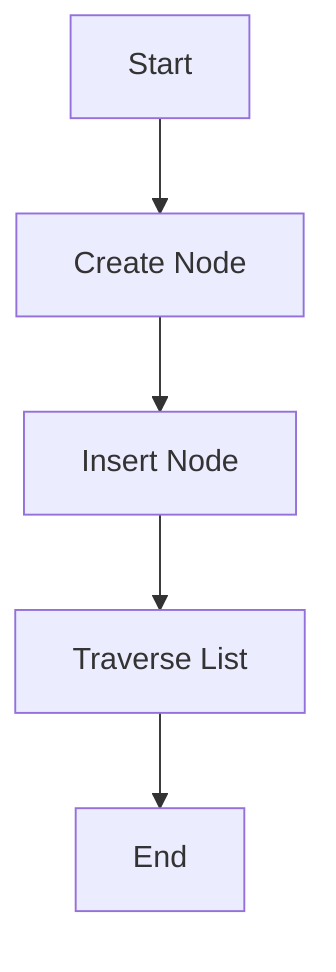

### Doubly Linked List

A doubly linked list has nodes with two references: one to the next node and one to the previous node.

#### Example

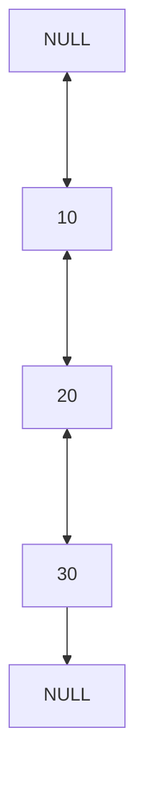

### Flow Chart


### Circular Linked List

In a circular linked list, the last node points back to the first node.

#### Example

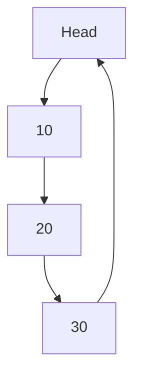

### Flow Chart


---

## Stacks

A stack is a collection of elements with Last In, First Out (LIFO) access policy.

### Characteristics
- **Push**: Add an element to the top of the stack.
- **Pop**: Remove the top element from the stack.
- **Peek**: Retrieve the top element without removing it.

### Example

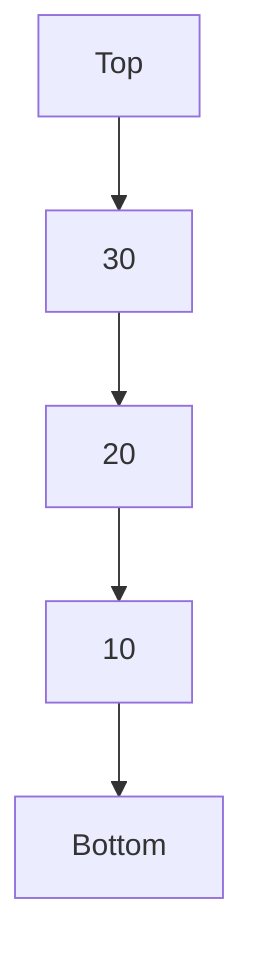

### Flow Chart

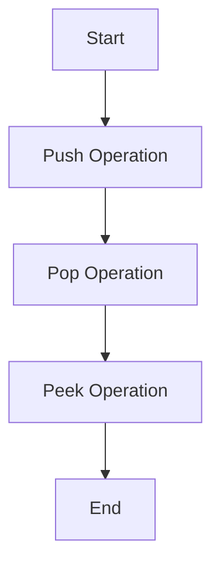

---

## Queues

A queue is a collection of elements with First In, First Out (FIFO) access policy.

### Simple Queue

Elements are added to the rear and removed from the front.

#### Example

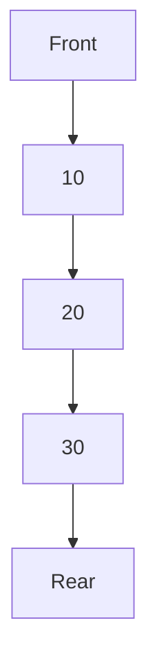

### Flow Chart

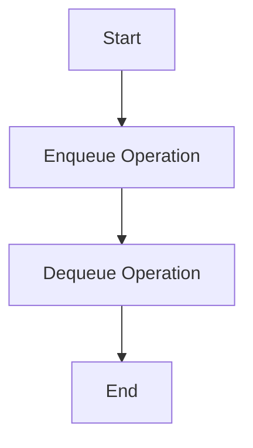

### Circular Queue

A circular queue connects the end of the queue back to the beginning, forming a circle.

#### Example

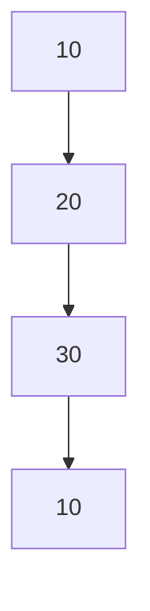

### Flow Chart

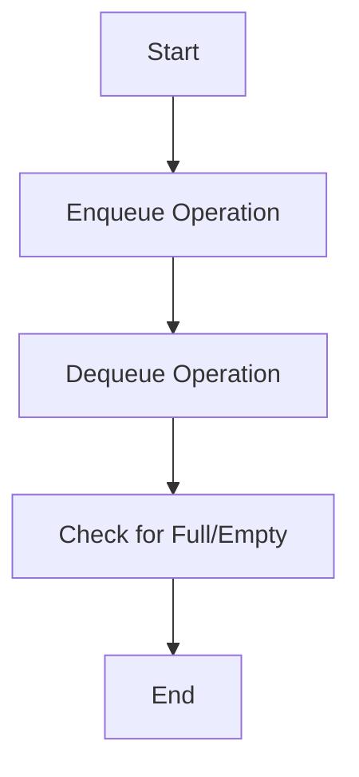

### Priority Queue

A priority queue processes elements based on their priority

 rather than their order of arrival.

### Flow Chart

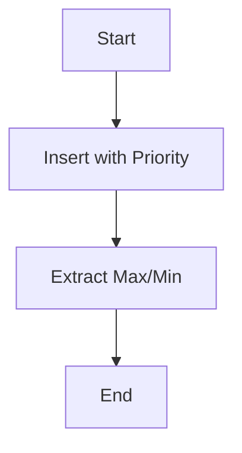

---

## Trees

A tree is a hierarchical data structure consisting of nodes with a parent-child relationship.

### Binary Trees

A binary tree is a tree in which each node has at most two children.

#### Example

```mermaid
graph TD;
    A[10]
    A --> B[20]
    A --> C[30]
    B --> D[40]
    B --> E[50]
```

### Flow Chart

```mermaid
graph TD;
    A[Start] --> B[Create Node]
    B --> C[Insert Left/Right]
    C --> D[Traverse Tree]
    D --> E[End]
```

### Binary Search Trees (BST)

A binary search tree is a binary tree where each node follows the BST property: left subtree values are less than the node value, and right subtree values are greater.

#### Example

```mermaid
graph TD;
    A[20]
    A --> B[10]
    A --> C[30]
    B --> D[15]
    C --> E[25]
```

### Flow Chart

```mermaid
graph TD;
    A[Start] --> B[Create Node]
    B --> C[Insert Node]
    C --> D[Traverse Tree]
    D --> E[End]
```

### AVL Trees

An AVL tree is a self-balancing binary search tree where the height difference between left and right subtrees is at most one.

### Flow Chart

```mermaid
graph TD;
    A[Start] --> B[Insert Node]
    B --> C[Balance Tree]
    C --> D[End]
```

### Heap Trees

A heap is a specialized tree-based data structure that satisfies the heap property.

#### Example

```mermaid
graph TD;
    A[50]
    A --> B[30]
    A --> C[20]
    B --> D[15]
    B --> E[10]
```

### Flow Chart

```mermaid
graph TD;
    A[Start] --> B[Insert Node]
    B --> C[Heapify]
    C --> D[Extract Max/Min]
    D --> E[End]
```

---

## Graphs

A graph is a collection of nodes (vertices) and edges connecting them.

### Graph Representations

- **Adjacency Matrix**: A 2D array where `matrix[i][j]` represents the edge between vertex `i` and `j`.
- **Adjacency List**: A list where each node has a list of adjacent nodes.

#### Example (Adjacency Matrix)

```mermaid
graph TD;
    A[0] --> B[1]
    A --> C[2]
    B --> D[1]
    C --> E[0]
```

#### Example (Adjacency List)

```mermaid
graph TD;
    A[0] --> B[1]
    B[1] --> C[2]
    C[2] --> D[3]
    D[3] --> E[0]
```

### Graph Traversal Algorithms

- **Depth-First Search (DFS)**: Explores as far as possible along each branch before backtracking.
- **Breadth-First Search (BFS)**: Explores all neighbors at the present depth before moving on to nodes at the next depth level.

### Flow Chart for DFS

```mermaid
graph TD;
    A[Start] --> B[Visit Node]
    B --> C[Explore Neighbors]
    C --> D[Backtrack]
    D --> E[End]
```

### Flow Chart for BFS

```mermaid
graph TD;
    A[Start] --> B[Visit Node]
    B --> C[Queue Neighbors]
    C --> D[Dequeue Node]
    D --> E[End]
```

---

## Hash Tables

A hash table stores key-value pairs where keys are hashed to determine the index for storing values.

### Characteristics
- **Hash Function**: Maps keys to indices in the hash table.
- **Collision Handling**: Techniques like chaining or open addressing to handle collisions.

### Example

```mermaid
graph TD;
    A[Key: "Name"] --> B[Hash: 2]
    B --> C[Value: "Alice"]
    D[Key: "Age"] --> E[Hash: 4]
    E --> F[Value: 30]
```

### Flow Chart

```mermaid
graph TD;
    A[Start] --> B[Hash Key]
    B --> C[Store in Table]
    C --> D[Handle Collision]
    D --> E[End]
```

---